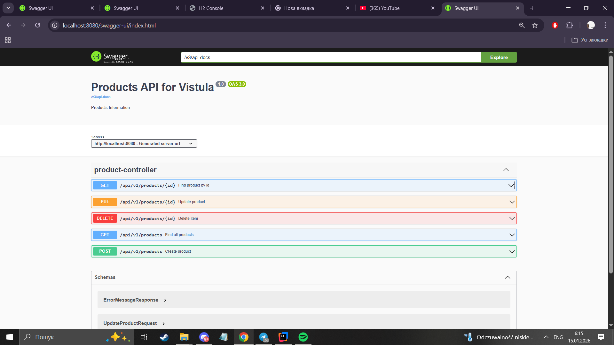
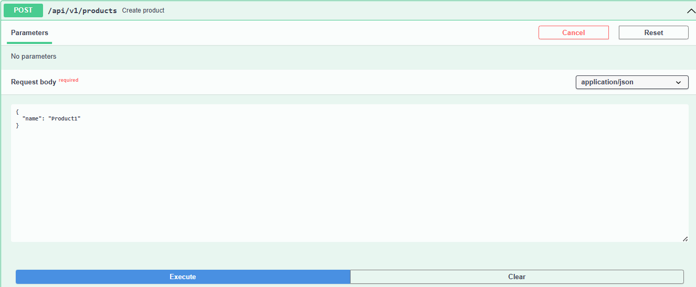
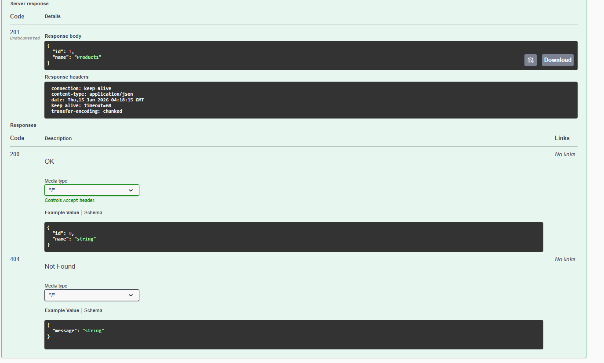
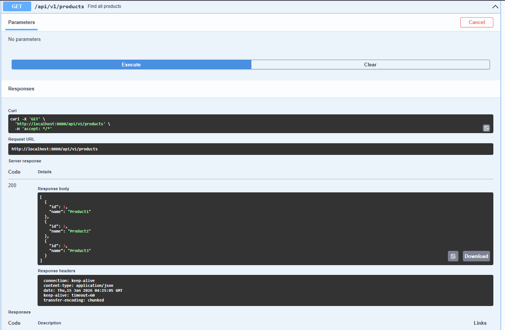
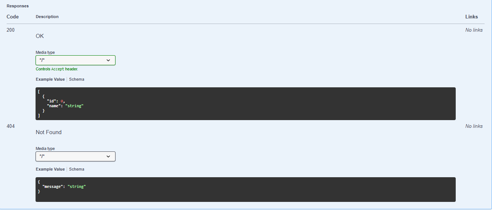
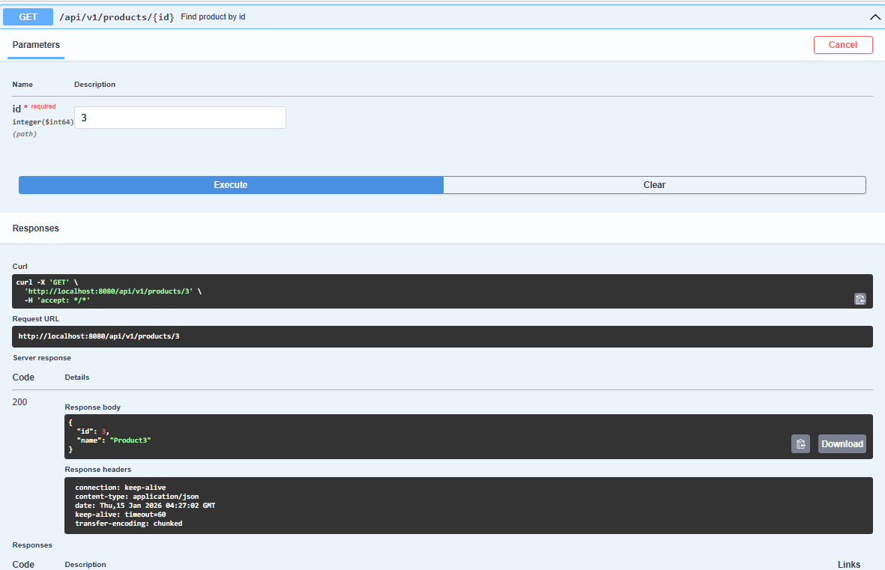
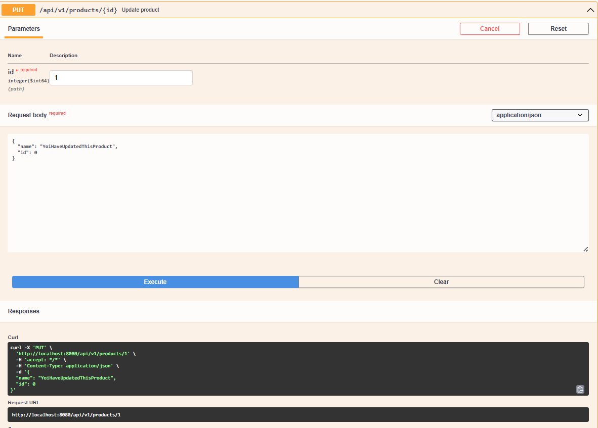
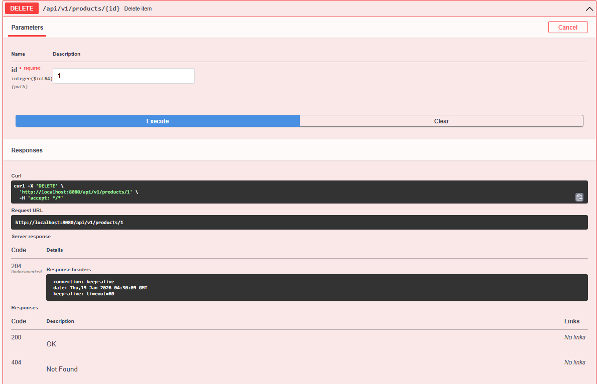
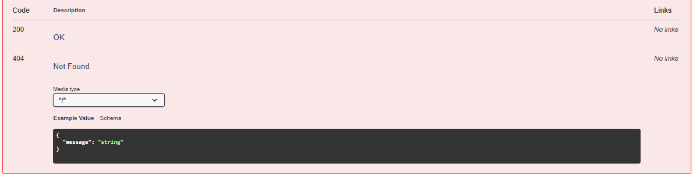
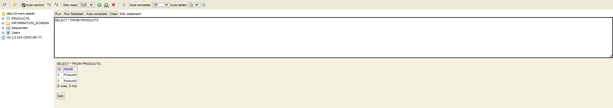

FirstRestApi2 – Product REST API
📌 Project Description

This project is a simple REST API application created using Spring Boot.
The application allows managing products using basic CRUD operations (Create, Read, Update, Delete)
Also uses h2 database that's implemented in-memory.

🛠 Technologies Used

Java 

Spring Boot

Spring Web

Spring Dependency Injection

In-memory database (Map-based repository)

Springdoc OpenAPI (Swagger UI)

1.How to Run the App

Clone this repository to your computer.
Open the folder in IntelliJ IDEA.
Run the file FirstRestApiSpringApplication.java.
The server will start at http://localhost:8080.

API Screenshots and Overall documentation
(using swagger)

Here you can see all the endpoints that were generated automatically  

http://localhost:8080/swagger-ui/index.html

Creating product by using POST

2.Get All Products by using GET   

3 Get Product by ID using GET

4 Update Product by PUT

 

5 Delete the Product (by using DELETE ofc)

 

H-2 database overview
You can view it directly in your browser just by accessing this link and using this data to log in:

URL: http://localhost:8080/console
JDBC URL: jdbc:h2:mem:testdb
User: sa
Password: (Leave blank)
Use command SELECT * FROM PRODUCTS

